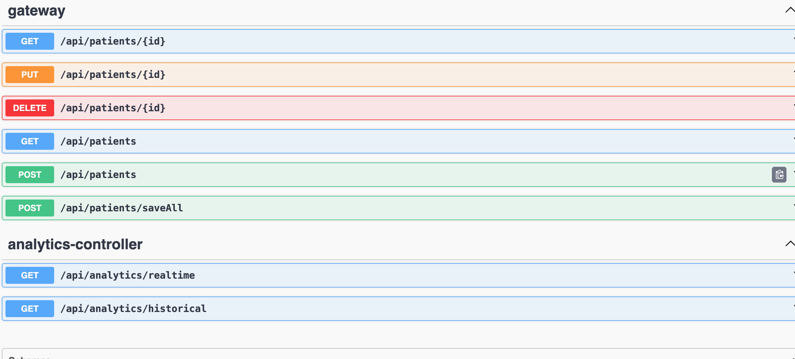
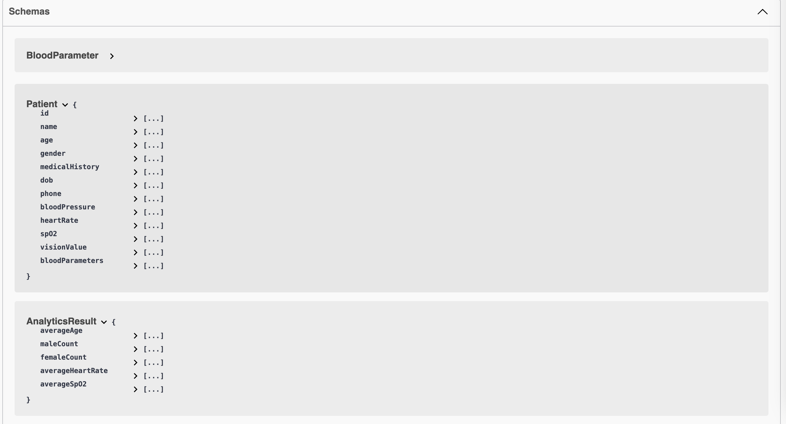

# Healthcare Analytics System

## Project Overview
This project implements a Healthcare Analytics System using Spring Boot and Firebase Realtime Database. It allows for managing patient records and performing analytics on various health parameters.

## Features
- CRUD operations for patient records
- Real-time analytics on patient data
- Integration with Firebase Realtime Database for data storage

## Technologies Used
- Java
- Spring Boot
- Firebase Realtime Database

## Getting Started
To run this project locally, follow these steps:

1. **Clone the repository:**
   ```bash
   git clone <repository-url>
   cd healthcare-analytics-system


## Set up Firebase:

Create a Firebase project at Firebase Console.
Add your Firebase config to src/main/resources/application.properties:

```bash
# Firebase Config
firebase.database.url=<your-firebase-database-url>
firebase.api.key=<your-api-key>
```

## Run the application:
```bash
./gradlew bootRun
```
## Access the application:
Open http://localhost:8080 in your browser.




## Patient json object
API Endpoints
GET /patients: Retrieve all patients
GET /patients/{id}: Retrieve a patient by ID
PUT /patients/{id}: Update an existing patient
DELETE /patients/{id}: Delete a patient by ID
```json

{
"name": "John Doe",
"age": 30,
"gender": "Male",
"medicalHistory": "No significant medical history",
"dob": "1994-01-01",
"phone": "+1234567890",
"bloodPressure": "120/80 mmHg",
"heartRate": "70 bpm",
"spO2": "98%",
"visionValue": "20/20",
"bloodParameters": [
{
"name": "Hemoglobin",
"value": "15 g/dL"
},
{
"name": "White Blood Cells",
"value": "8000/mm3"
}
]
}

```

## Contributors

```html
<h1>AJAY PRAJAPATI</h1>
```

## License
```html
This project is licensed under the MIT License - see the LICENSE file for details.
```

```markdown

### Notes:
- Replace `<repository-url>` with the actual URL of your GitHub repository.
- Adjust the `Run the application` step to use `./gradlew bootRun` for Gradle projects.
- Ensure your Firebase setup (`firebase.database.url` and `firebase.api.key`) is correctly configured in `application.properties`.
- Customize the API endpoints and payload examples (`POST /patients` example) as per your project's requirements.
  
This format keeps all the project information in a single Markdown file for easy readability and distribution within your Gradle-based project repository. Adjust the content further based on your specific implementation details.

```